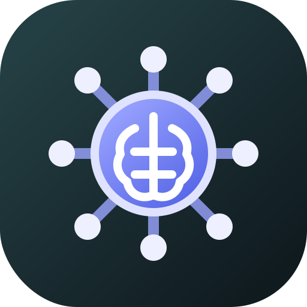

<p align="center"></p>

<h1 align="center">Recall</h1>

<p align="center">
  <strong>Your decisions should outlive the session that created them.</strong><br />
  A private, local-first memory system for ideas, decisions, projects, and coding agents.
</p>

<p align="center">
  <a href="LICENSE"></a>
  
  
</p>

Recall captures the reasoning behind your work and brings it back when the context matches. Memories can be connected to a repository, branch, file, project, topic, priority, and lifecycle stage. Use the visual dashboard, the CLI, or the included MCP server from an AI coding tool.

No account is required. The desktop application binds to localhost and stores readable memories in one SQLite database on your computer.

## Why Recall?

Source code records *what* changed. Issue trackers record *what* was requested. Recall preserves the missing layer: **why a decision was made, what was already tried, and what should happen next**.

- Return to a branch and recover its decisions.
- Organize memories into projects and lifecycle stages.
- Explore topic hubs in an animated, zoomable memory galaxy.
- Capture from the CLI, dashboard, MCP clients, Markdown folders, or an optional mobile PWA.
- Turn one memory into editable `SPEC.md`, `PROMPT.md`, and `SKILL.md` implementation handoffs.
- Keep the core workflow entirely local, including AI generation through Ollama.

## Features

| Area | What it provides |
| --- | --- |
| Local dashboard | Search, capture, projects, lifecycle, priorities, topics, and memory management |
| Memory galaxy | Interactive canvas graph with topic/project hubs and zoom controls |
| Context-aware recall | Repository, branch, file, keyword, status, and recency ranking with an explanation |
| CLI | Fast capture, recall, ingestion, digest, resolution, and generation commands |
| MCP server | Shared memory tools for Codex, Claude Code, Cursor, and other MCP clients |
| AI handoffs | Reviewable specifications, prompts, skills, ZIP export, Ollama/OpenAI/Anthropic-compatible providers |
| Optional mobile companion | Installable Android PWA, offline capture, Android Share target, encrypted synchronization |

## Quick start from source

### Requirements

- Node.js 22.5 or newer (Recall uses the built-in `node:sqlite` module)
- npm
- Git is optional, but enables repository-aware context

```bash
git clone https://github.com/A2Welt/Recall.git
cd Recall
npm ci
npm run build
npm link
recall serve --open
```

Without `npm link`, run it directly:

```bash
node dist/cli/index.js serve --open
```

The dashboard is available at `http://127.0.0.1:4321`. The server listens only on the loopback interface.

> The first semantic-search operation downloads the default embedding model (approximately 30 MB) into the Hugging Face cache. Inference runs locally after that.

## A two-minute workflow

```bash
cd ~/code/my-app
recall add "Use PostgreSQL because the reporting model depends on JSONB indexes"
recall recall "database choice"
recall ingest ~/notes
recall list --open
recall serve --open
```

## CLI reference

| Command | Description |
| --- | --- |
| `recall add "<text>" [--file <path>] [--repo <path>]` | Capture a memory with current Git context |
| `recall ingest <path>` | Incrementally import an Obsidian vault, Logseq graph, or Markdown folder |
| `recall recall ["<query>"] [--limit <n>]` | Retrieve contextually relevant memories |
| `recall list [--repo] [--open]` | List memories, optionally filtered |
| `recall resolve <id>` | Resolve a memory using its UUID or unique prefix |
| `recall digest` | Show recent and resurfaced memories |
| `recall serve [--port <n>] [--open]` | Start the local dashboard |
| `recall mcp` | Start the stdio MCP server |
| `recall ai configure` | Configure an encrypted AI provider |
| `recall ai status` / `recall ai lock` | Inspect or lock provider configuration |
| `recall generate <id> --target <target> --types <list> --out <dir>` | Generate an implementation handoff |

Run `recall --help` or `recall <command> --help` for complete options.

## Connect an MCP client

A source checkout can be connected to any MCP client with:

```json
{
  "mcpServers": {
    "recall": {
      "command": "node",
      "args": ["/absolute/path/to/Recall/dist/cli/index.js", "mcp"]
    }
  }
}
```

The MCP server exposes:

- `capture_idea` — store a memory from an agent session.
- `recall_ideas` — retrieve relevant decisions for the current context.
- `list_open_ideas` — inspect unresolved work.
- `resolve_idea` — close a completed thread.

Suggested agent instruction:

> Before implementation, call `recall_ideas` with the current repository and branch. Use returned decisions as context, but verify them against the current code.

## How context-aware recall works

Recall combines several signals instead of treating memory as a flat notes list:

1. Repository, branch, and file proximity.
2. SQLite FTS5 keyword relevance.
3. Optional local semantic similarity.
4. Open/resolved status and recency.

Every result includes a short reason explaining why it surfaced. Recall does not silently read arbitrary repository files when generating AI handoffs; only the selected memory and its stored metadata are sent.

## AI implementation handoffs

Open a memory in the dashboard and choose **Generate implementation package**, or use:

```bash
recall ai configure
recall generate <memory-id> --target codex --types spec,prompt,skill --out .recall-handoff
```

Recall supports Ollama, OpenAI-compatible APIs, and Anthropic-compatible APIs. Provider configuration is encrypted using scrypt and AES-256-GCM. The passphrase is not stored, decrypted credentials remain in process memory only, and dashboard sessions automatically lock after inactivity.

## Where data is stored

The SQLite database is created outside the repository:

| Platform | Default database path |
| --- | --- |
| Windows | `%LOCALAPPDATA%\recall\Data\recall.db` |
| macOS | `~/Library/Application Support/recall/recall.db` |
| Linux | `~/.local/share/recall/recall.db` |

Back up `recall.db` to preserve memories. WAL sidecar files may exist while Recall is running, so stop the server before taking a raw file copy.

Encrypted AI and mobile configuration also live in the operating system’s application config directory, never in this repository or browser local storage.

## Optional mobile companion

The desktop application is completely usable without Cloudflare or any hosted service. Mobile synchronization is an optional, self-hosted companion composed of a static PWA, a small Cloudflare Worker, and a D1 database containing ciphertext only.

The phone can capture offline, receive a read-only encrypted library snapshot, group memories by topic or project, and accept shared text from Google Keep and other Android apps. Follow [the self-hosting guide](docs/mobile-capture.md) to deploy your own instance.

## Privacy and security model

- No account, advertising, analytics, or telemetry.
- The desktop HTTP server binds to `127.0.0.1` only.
- Readable memories remain in local SQLite.
- AI is disabled until the user configures a provider and explicitly generates an artifact.
- Ollama provides an entirely local AI path.
- Mobile relay data is encrypted on-device with AES-256-GCM; the relay never receives the encryption key.
- Secrets, databases, local Wrangler configuration, generated artifacts, and environment files are ignored by Git.

Please report security issues according to [SECURITY.md](SECURITY.md).

## Development

```bash
npm ci
npm run build
npm test
```

Worker development is separate:

```bash
cd workers-sync
npm ci
npm run type-check
npm run dev
```

See [CONTRIBUTING.md](CONTRIBUTING.md) before opening a pull request.

## Project status

Recall is early-stage software. Database migrations are additive, but APIs and UI behavior may still change before a stable release. Back up important data and review generated AI artifacts before using them.

## License

Recall is available under the [MIT License](LICENSE).
